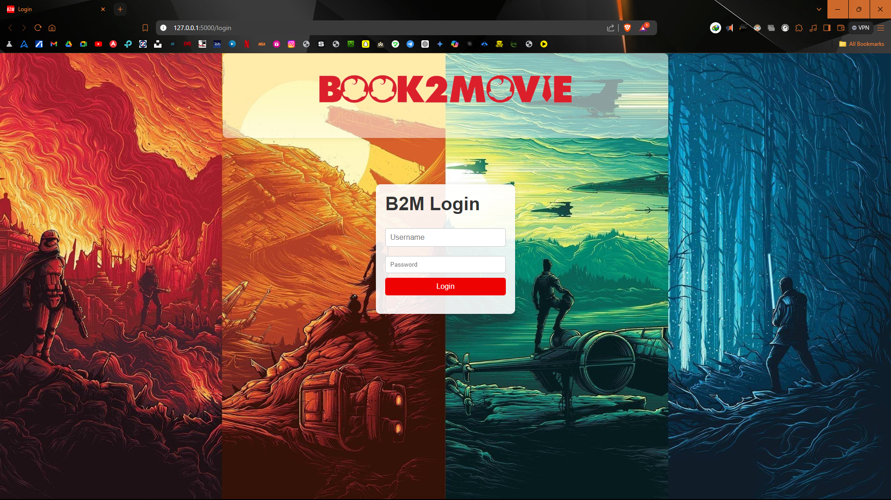
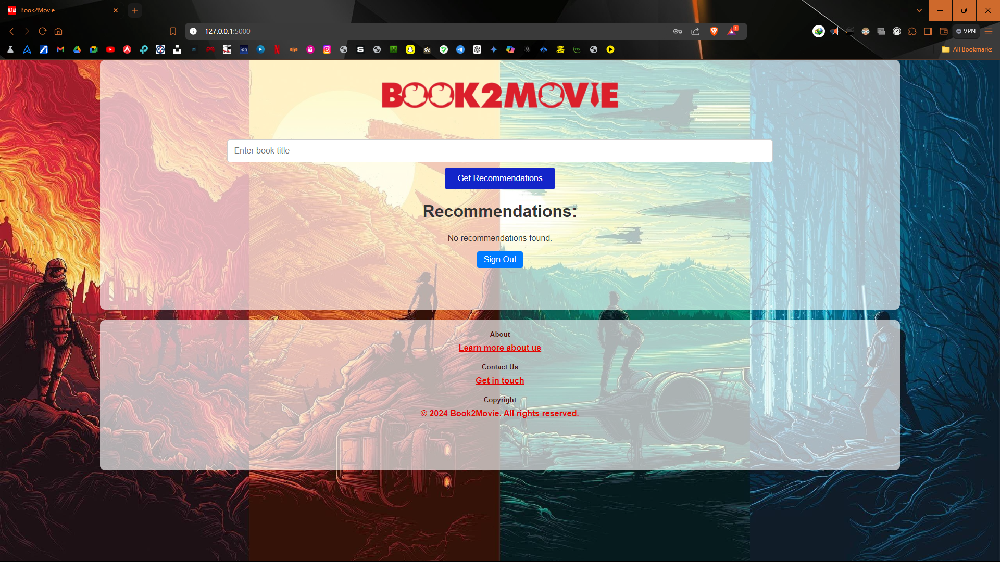
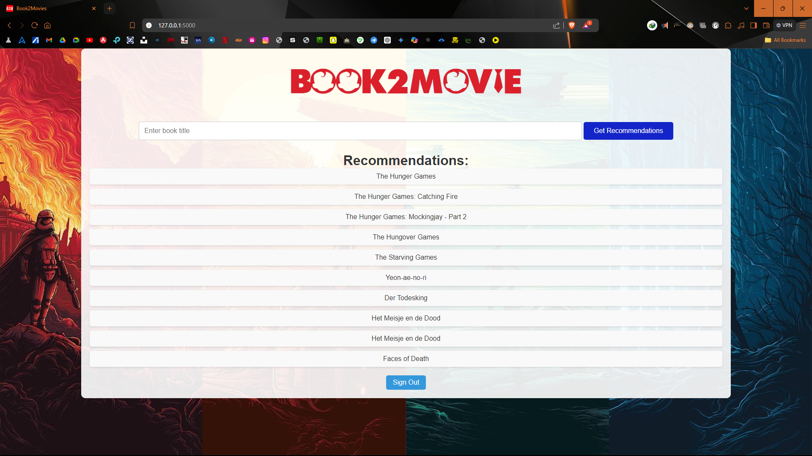

# Book2Movie


## Project Description
Book2Movie is a recommendation system project that leverages data from Goodreads and movie databases to provide book-to-movie recommendations. The project includes a web application, data analysis scripts, and a comprehensive report on the methodology used.

## Installation
To install the necessary dependencies, run the following command:
```bash
pip install -r requirements.txt
```

## Usage
### Running the Web Application
To start the web application, navigate to the project directory and run:
```bash
python app.py
```
The application will be accessible at `http://127.0.0.1:5000/`.

### Jupyter Notebooks
The project includes Jupyter notebooks for data analysis and model training. Open the notebooks using Jupyter:
```bash
jupyter notebook
```
Navigate to the `Book2Movie/Training` directory and open `Book2Movie.ipynb`.

## Project Structure
- **app.py**: Main application file for the web app.
- **test.py**: Test script for the project.
- **Book2Movie.ipynb**: Jupyter notebook for data analysis and model training.
- **static/**: Directory containing static files (CSS, images).
- **templates/**: Directory containing HTML templates for the web app.
- **Dataset/**: Directory containing datasets used in the project.
- **img/**: Directory containing images for the project.

## Data Sources
- **Goodreads Dataset**: Contains book-related data such as book descriptions, tags, and ratings.
- **Movies Dataset**: Contains movie-related data such as keywords, metadata, and ratings.

## Example Images
Here are some example images used in the project:





## License
This project is licensed under the terms of the LICENSE file.

## Acknowledgments
Special thanks to the authors of the literature review papers and datasets used in this project.
