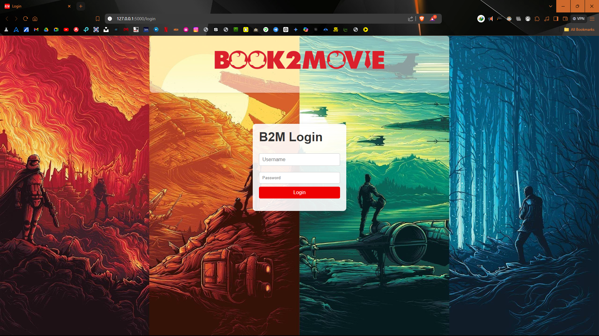
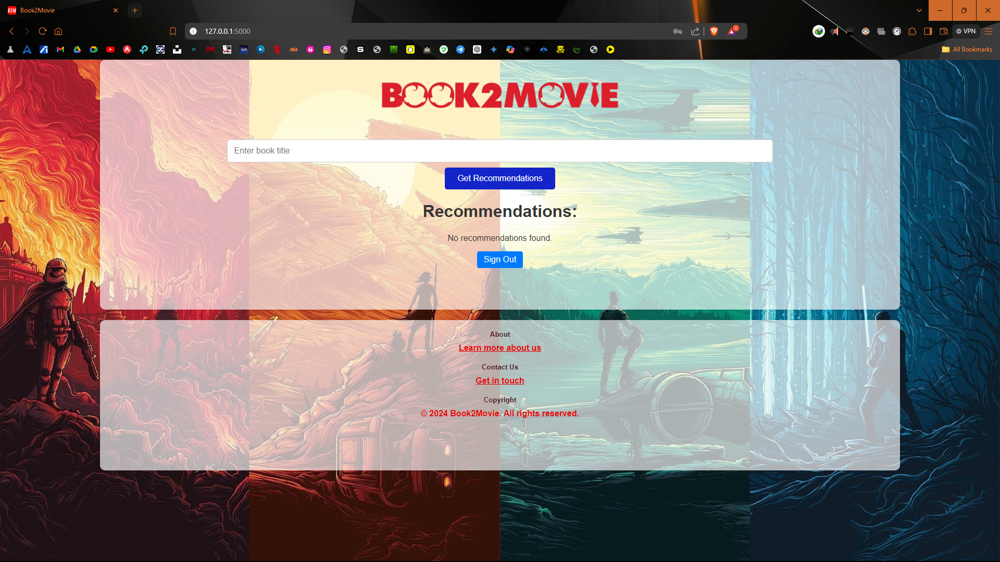
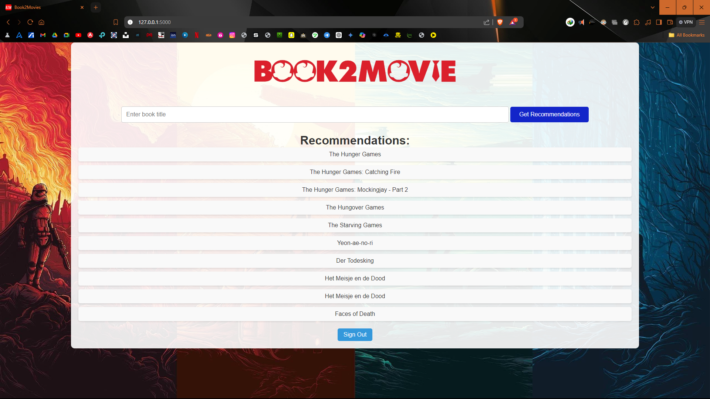

# Book2Movie: A Cosine Similarity-based RAG-powered NLP & LLM Recommendation System


## Project Description
Book2Movie is an AI-driven system that recommends movies based on book descriptions using text similarity techniques. In addition, it features a Generative AI RAG module that enables interactive question-answering on movie plots through FAISS retrieval and the LLaMA model. Together, these components create a seamless pipeline from discovering a book, finding related movies, and exploring their plots with AI-generated insights.

## Installation
To install the necessary dependencies, run the following command:
```bash
pip install -r requirements.txt
```

## Usage
### Running the Web Application
To start the web application, navigate to the project directory and run:
```bash
python app.py
```
The application will be accessible at `http://127.0.0.1:5000/`.

### Jupyter Notebooks
The project includes Jupyter notebooks for data analysis and model training. Open the notebooks using Jupyter:
```bash
jupyter notebook
```
Navigate to the `Book2Movie/Training` directory and open `Book2Movie.ipynb`.

## Project Structure
- **app.py**: Main application file for the web app.
- **test.py**: Test script for the project.
- **Book2Movie.ipynb**: Jupyter notebook for data analysis and model training.
- **static/**: Directory containing static files (CSS, images).
- **templates/**: Directory containing HTML templates for the web app.
- **Dataset/**: Directory containing datasets used in the project.
- **img/**: Directory containing images for the project.

## Data Sources
- **Goodreads Dataset**: Contains book-related data such as book descriptions, tags, and ratings.
- **Movies Dataset**: Contains movie-related data such as keywords, metadata, and ratings.

## GenAI RAG Module for Movie Plot Q&A

In addition to book-to-movie recommendations, this repo now includes a **Generative AI Retrieval-Augmented Generation (RAG) pipeline** to answer questions about movie plots.

### Notebook: `Nithin_GenAI_RAG_preview.ipynb`
This notebook demonstrates an end-to-end RAG workflow using the **Wikipedia Movie Plots Dataset (~34k records)**.

**Pipeline Overview:**
1. **Embedding & Retrieval**: Movie plots are encoded into embeddings and stored in a **FAISS vector store**.
2. **Generation**: A **LLaMA 3.2-1B Instruct model** generates coherent answers from the retrieved plots.
3. **Query Examples**:
   - *"What is the plot of Inception?"*
   - *"Do The Lake House and The Time Traveler’s Wife share similar themes?"*

**Tech Stack:**
- Hugging Face Transformers, LangChain, FAISS
- Sentence-Transformers for embeddings
- LLaMA 3.2-1B for generation

**Future Enhancements:**
- Use larger models (e.g., LLaMA-7B, Mistral) for richer answers
- Add evaluation metrics (retrieval recall, answer accuracy)
- Build an interactive front-end (Gradio/Streamlit)
- Integrate with Book2Movie to create a “Book → Movie → Plot Q&A” pipeline

## Example Images
Here are some example images used in the project:





## License
This project is licensed under the terms of the LICENSE file.

## Acknowledgments
Special thanks to the authors of the literature review papers and datasets used in this project.
